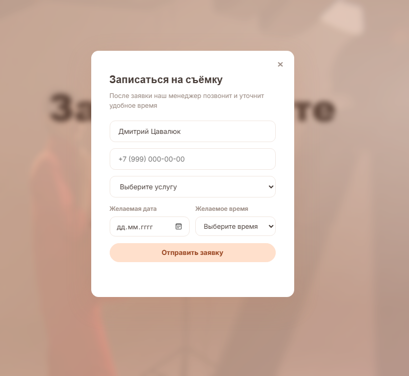
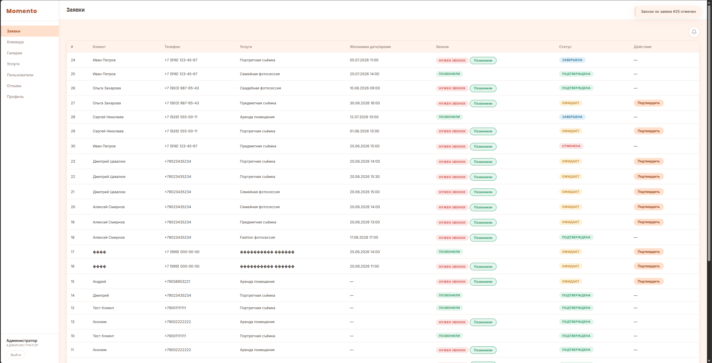
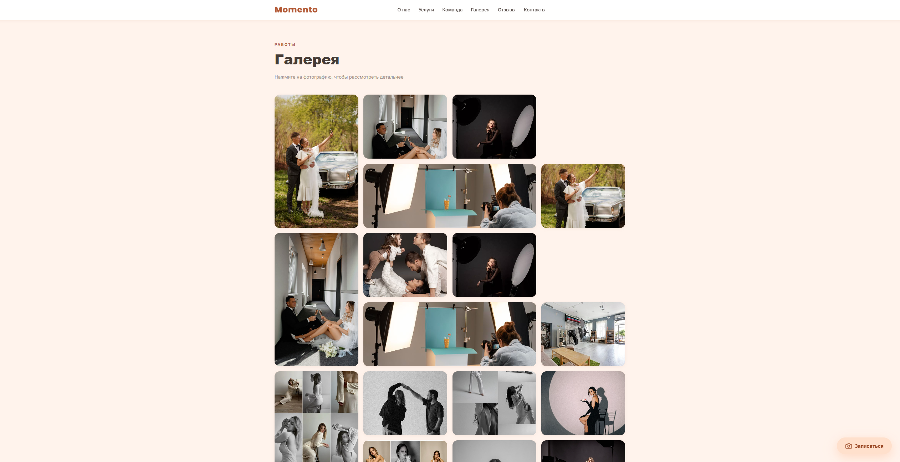

# Momento — Сайт фотостудии

> Fullstack-приложение для онлайн-записи, управления заявками и работы с командой фотостудии.


---

## Скриншоты

> Сделайте скриншоты приложения и сохраните их в папку `screenshots/`.

| Главная страница | Форма записи | Панель управления |
|:---:|:---:|:---:|
|  |  |  |

| Галерея | Команда | Отзывы |
|:---:|:---:|:---:|
|  |  |  |

---

## Демо

> **Ссылка на демо:** _будет добавлена после деплоя_

**Демо-логины для проверки:**

| Email | Пароль | Роль |
|---|---|---|
| `admin@momento.ru` | `test123` | Администратор |
| `photo@momento.ru` | `test123` | Фотограф |
| `manager@momento.ru` | `test123` | Менеджер |
| `client@demo.ru` | `demo123` | Клиент |

---

## Стек технологий

### Backend
- **Node.js + Express** — REST API сервер
- **SQLite (sqlite3)** — встроенная база данных, без отдельного сервера
- **JWT** — аутентификация и авторизация (роли: `admin`, `employee`, `client`)
- **Bcrypt** — хэширование паролей
- **Nodemailer** — отправка email-уведомлений через SMTP (Yandex)
- **SSE (Server-Sent Events)** — real-time уведомления на дашборде
- **Multer** — загрузка фото (команда, услуги, галерея)

### Frontend
- **Vanilla JS** — без фреймворков, нативный fetch API
- **CSS Custom Properties** — дизайн-токены (цвета, тени, радиусы)
- **CSS Grid + Flexbox** — адаптивная вёрстка
- **Intersection Observer** — анимации при скролле
- **LocalStorage** — хранение JWT-сессии

---

## Возможности

- **Публичный сайт:** Hero-секция с видео-фоном, каталог услуг, 3D-карусель команды, галерея с лайтбоксом, слайдер отзывов, форма обратной связи
- **Онлайн-запись:** выбор услуги, мастера, даты и времени (временные слоты), уведомление на email
- **Личный кабинет:** регистрация с подтверждением email (6-значный код), просмотр своих заявок, оставление отзывов
- **Панель сотрудника:** список заявок с фильтрацией и сортировкой, изменение статусов, трекер звонков, SSE-уведомления о новых заявках в реальном времени
- **Панель администратора:** управление командой (фото, специализация), услугами, галереей; модерация отзывов; просмотр обратной связи; SMTP-настройки

---

## Архитектура API

| Метод | Путь | Доступ | Описание |
|-------|------|--------|----------|
| `GET` | `/api/test` | public | Health check |
| `POST` | `/api/login` | public | Вход |
| `GET` | `/api/me` | auth | Данные текущего пользователя |
| `GET` | `/api/services` | public | Список услуг |
| `GET` | `/api/employees` | public | Список сотрудников |
| `GET` | `/api/team` | public | Команда (для карусели) |
| `GET` | `/api/gallery` | public | Фотогалерея |
| `GET` | `/api/reviews` | public | Опубликованные отзывы |
| `POST` | `/api/bookings` | public / auth | Создать заявку |
| `GET` | `/api/bookings` | employee+ | Все заявки |
| `PATCH` | `/api/bookings/:id/status` | employee+ | Сменить статус |
| `PATCH` | `/api/bookings/:id/call-status` | employee+ | Отметить звонок |
| `PUT` | `/api/bookings/:id/confirm` | employee+ | Подтвердить + уведомить клиента |
| `POST` | `/api/reviews` | auth | Оставить отзыв |
| `PATCH` | `/api/reviews/:id/publish` | admin | Опубликовать отзыв |
| `POST` | `/api/feedback` | public | Обратная связь (сохраняется в БД) |
| `POST` | `/api/contact` | public | Контактная форма (только email) |
| `GET` | `/api/dashboard/sse` | employee+ | SSE-поток уведомлений |

**Авторизация:** `Authorization: Bearer <token>`

---

## Быстрый старт

### 1. Клонировать репозиторий

```bash
git clone <url>
cd "Momento photo"
```

### 2. Установить зависимости

```bash
cd backend
npm install
```

### 3. Настроить окружение

```bash
cp ../.env.example .env
```

Отредактируйте `backend/.env`:

```env
JWT_SECRET=ваш-секретный-ключ-минимум-32-символа

# Опционально — SMTP для email-уведомлений (Yandex):
MAIL_HOST=smtp.yandex.ru
MAIL_PORT=465
MAIL_USER=ваш@yandex.ru
MAIL_PASS=пароль-приложения
```

### 4. Заполнить БД демо-данными

```bash
npm run seed
```

Создаёт услуги, команду и демо-заявки с отзывами. В конце выводит логины для входа.

### 5. Запустить

```bash
# Продакшн
npm start

# Разработка (авто-перезапуск)
npm run dev
```

Откройте **http://localhost:3000**

---

## Структура проекта

```
Momento photo/
│
├── backend/                        # Node.js сервер
│   ├── app.js                      # Entry point: Express + маршруты + статика
│   ├── seed.js                     # Наполнение БД демо-данными
│   ├── package.json
│   │
│   ├── routes/
│   │   ├── index.js                # Публичные и общие API-маршруты
│   │   ├── auth.js                 # POST /login, GET /me
│   │   ├── dashboard.js            # Маршруты дашборда (SSE, аналитика)
│   │   └── admin.js                # Административные маршруты
│   │
│   ├── models/                     # Слой работы с SQLite
│   │   ├── User.js                 # Пользователи, команда, SMTP-настройки
│   │   ├── Booking.js              # Заявки и их статусы
│   │   ├── Review.js               # Отзывы с модерацией
│   │   ├── Service.js              # Услуги с фото
│   │   ├── GalleryPhoto.js         # Галерея
│   │   ├── Feedback.js             # Обратная связь
│   │   └── EmailVerification.js    # Коды подтверждения при регистрации
│   │
│   ├── middleware/
│   │   └── auth.js                 # JWT: authenticate, requireRole, optionalAuth
│   │
│   └── utils/
│       ├── db.js                   # Инициализация SQLite + миграции
│       ├── email.js                # Nodemailer: booking/confirm/feedback письма
│       └── sse.js                  # Server-Sent Events: broadcast к дашбордам
│
├── frontend/                       # Статические файлы (раздаёт Express)
│   ├── index.html                  # Публичный сайт
│   ├── dashboard.html              # Панель сотрудника / администратора
│   │
│   ├── css/
│   │   ├── style.css               # Стили публичного сайта
│   │   └── dashboard.css           # Стили панели управления
│   │
│   ├── js/
│   │   ├── main.js                 # Логика публичного сайта
│   │   └── dashboard.js            # Логика панели управления
│   │
│   ├── uploads/                    # Загружаемые файлы
│   │   ├── gallery/                # Фото галереи
│   │   ├── services/               # Фото услуг
│   │   └── team/                   # Фото команды
│   │
│   └── video/
│       └── sample.mp4              # Видео-фон Hero-секции
│
├── screenshots/                    # Скриншоты для README
├── .env.example                    # Шаблон переменных окружения
├── .gitignore
└── README.md
```

---

## Деплой

Рекомендуемые платформы:

- **[Railway](https://railway.app)** — автодеплой из GitHub, поддерживает Node.js + SQLite
- **[Render](https://render.com)** — бесплатный тир с sleep-режимом
- **[VPS (Ubuntu)](https://timeweb.cloud)** — PM2 + Nginx reverse proxy

Для деплоя достаточно загрузить весь проект и задать переменные окружения (`JWT_SECRET`, опционально SMTP).

---

## Лицензия

MIT © 2026 Momento Studio
